# FIFA World Cup 2026 — Prediction Engine



<p align="center">
  
  
  
</p>

A from-scratch Python engine that predicts the 2026 World Cup. It fits a **Dixon-Coles
bivariate-Poisson goal model with an Elo strength covariate** to ~150 years of
international results, predicts the remaining group fixtures, and runs a **Monte-Carlo
simulation** of the full 48-team tournament to estimate each nation's odds of advancing
and lifting the trophy.

## Spain Victory Celebration

> **Hambalyo weyn Spain.** Model-kan saadaasha wuxuu hore u muujiyey in Spain ay
> fursad xooggan u leedahay inay koobka qaaddo, saadaashiina way rumowday.

Mahadsanidiin dhammaan fans-ka taageeray mashruucan, la socday saadaasha, lana
wadaagay xiisaha kubadda cagta. Guushan Spain waa caddeyn kale oo muujinaysa in
xogta, falanqaynta, iyo jacaylka ciyaartu ay abuuri karaan sheeko qurux badan.

**Vamos Spain. Hambalyo champions!**

## Project structure

```
.
├── data/                 raw input CSVs (results, goalscorers, shootouts)
├── outputs/              generated tables + charts (from the pipeline)
├── frontend/             Next.js dashboard (see frontend/README.md)
└── wc2026/               prediction engine (Python package)
    ├── config.py         paths, name normalization, tournament + model constants
    ├── data.py           load/clean CSVs, recover the 12 groups
    ├── models/           elo · poisson (Dixon-Coles) · simulate (Monte-Carlo)
    ├── api/              Flask app (app.py) + prediction service (service.py)
    └── cli/              full pipeline (main.py) · historical backtest (validate.py)
```

## Data

Three CSVs in `data/` (international results 1872–2026):

| file | rows | contents |
|------|------|----------|
| `data/results.csv` | 49,478 | every international match, incl. the 2026 WC group fixtures (4 played, 68 to predict) |
| `data/goalscorers.csv` | 47,614 | goal events (scorer, minute, penalty, own-goal) |
| `data/shootouts.csv` | 678 | penalty-shootout winners |

The 12 groups of 4 are **recovered from the fixture pairings** (connected components),
since the dataset doesn't label group letters.

## Install & run

```bash
pip install -r requirements.txt

python -m wc2026.data          # sanity: print recovered groups + played/unplayed split
python -m wc2026.cli.validate  # backtest vs WC 2014/2018/2022 (Dixon-Coles+Elo vs Elo baseline)
python -m wc2026.cli.main      # full pipeline -> tables + outputs/
```

`cli.main` options: `--iterations N` (default 20,000), `--seed S`, `--no-charts`.

## Backend API (Flask)

A REST API serves the engine for front-end / programmatic use. Models are fit once per
process; the tournament simulation is memoized per `(iterations, seed)`. CORS is enabled.

```bash
python -m wc2026.api                      # dev server on http://127.0.0.1:5000
gunicorn "wc2026.api:create_app()"        # production (Linux)
```

| method & path | description |
|---------------|-------------|
| `GET /api/health` | status + model parameters + fixture counts |
| `GET /api/teams` | all 48 teams with group and Elo, sorted by Elo |
| `GET /api/groups` | the 12 groups, their teams, and fixtures (with scores where played) |
| `GET /api/group-predictions` | W/D/L probs, xG, and likely score for each remaining group fixture |
| `GET /api/knockout` | projected qualifiers (winner / runner-up / best third) + the full knockout bracket |
| `GET /api/predict?home=Spain&away=Brazil[&neutral=true][&top_n=5]` | single-match prediction |
| `POST /api/predict` | same, body `{"home": "...", "away": "...", "neutral": true}` |
| `GET /api/champion-odds[?iterations=20000][&seed=42][&limit=N]` | full tournament simulation |

Example:

```bash
curl "http://127.0.0.1:5000/api/predict?home=Argentina&away=France"
# {"home":"Argentina","away":"France","probabilities":{"home_win":0.47,"draw":0.30,"away_win":0.22},
#  "expected_goals":{"home":1.27,"away":0.78},"most_likely_score":"1-0", ...}
```

Errors return JSON: unknown team or missing parameter → `400`, unknown route → `404`.

## Frontend (Next.js dashboard)

A web dashboard lives in [`frontend/`](frontend/) — Next.js 16 + TypeScript + Tailwind v4
+ shadcn/ui. It shows the champion-odds leaderboard, an interactive match predictor, the
12 groups, and per-fixture predictions, all served by the Flask API above.

```bash
python -m wc2026.api      # 1) start the API   → http://127.0.0.1:5000
cd frontend && npm install && npm run dev   # 2) start the UI → http://localhost:3000
```

See [`frontend/README.md`](frontend/README.md) for details.

## Outputs (`outputs/`)

- `group_predictions.csv` — W/D/L probabilities, expected goals, and a likely scoreline for each remaining group fixture.
- `advancement.csv` — per-team odds of winning the group / reaching each knockout round.
- `champion_odds.csv` — full per-team probabilities through to champion.
- `champion_odds.png` — top-15 champion-odds bar chart.

## How it works

| module | role |
|--------|------|
| `config.py` | paths, name normalization, tournament + model constants |
| `data.py` | load/clean CSVs, recover the 12 groups, split played vs unplayed |
| `models/elo.py` | football Elo (tournament-weighted K, margin-of-victory, home advantage) |
| `models/poisson.py` | Dixon-Coles MLE (analytic gradients, time-decay weights, Elo covariate) → score matrix / W-D-L |
| `models/simulate.py` | group standings (FIFA tiebreakers), qualifier selection, knockout bracket, Monte-Carlo driver |
| `api/service.py` | fits models once, caches the simulation, returns JSON-ready results |
| `api/app.py` | Flask REST API (`create_app` factory) on top of the service |
| `cli/main.py` | CLI tying the full pipeline together |
| `cli/validate.py` | historical backtest with accuracy / log-loss / Brier vs an Elo baseline |

**Model.** Expected goals for each side come from
`log λ = c + attack − defense + home_adv + w·(Elo diff)`, fit by weighted maximum
likelihood with a Dixon-Coles low-score correction (ρ) for realistic 0-0/1-0/1-1 rates.
Recent matches are weighted more (≈3-year half-life); Elo carries the bulk of the
team-strength signal so lightly-sampled teams are still rated sensibly.

**Simulation.** Each iteration samples scorelines for the 68 unplayed group games (the 4
already played are fixed), builds standings, picks the 12 winners + 12 runners-up + 8 best
thirds, seeds a balanced 32-team bracket (group-mates kept in opposite halves), and plays
it to a champion — knockout draws resolved by an Elo-tilted shootout. Probabilities are
the frequencies across all iterations.

**Projected bracket.** Alongside the probabilistic odds, `/api/knockout` returns a single
*most-likely* projection: an expected-points table per group (played games fixed, unplayed
games adding expected points/goal-difference) determines the 12 winners, 12 runners-up and
8 best thirds, who are seeded into the bracket and advanced tie-by-tie by the model
(draws resolved by an Elo-tilted shootout). This deterministic path can differ slightly
from the Monte-Carlo champion, which integrates over all possible paths.

### Caveats

- The official A–L group letters and FIFA's exact third-place lookup table aren't in the
  dataset; the bracket is a structurally faithful, balanced 2026-format tree with
  same-group-rematch avoidance, not the literal official slotting.
- Predictions reflect the data as of the latest results in `data/results.csv`.
